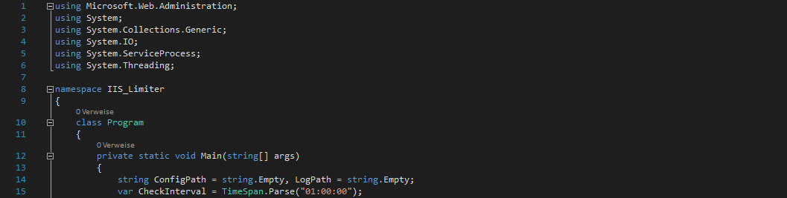

# NEF aus JPG's filtern

  

##Startparameter
###-config="Path"
(Plicht)Hier muss der Pfad zur Configdatei angegeben werden.
###-log="Path"
(Plicht)Hier muss der Pfad zur zukünftigen Log Datei angegeben werden.
###-checkinterval=00:00:00
(Optional)Hier muss man angeben in welchen Intervall das Tool die Bandbreite überprüfen soll. 1 Stunde (01:00:00) ist standard.

##Configeinträge (Beispiel)
1.Zeile: Ethernet 3,1-100,Default Web Site,52428800,150000,00:02:00,W3SVC
2.Zeile: Ethernet 3,101-1000,Default Web Site,943718400,150000,00:01:00,W3SVC

1. Adaptername = Ethernet 3
2. Trigger von/bis in Mbit/s = 1-100
3. Webseite, die limitiert werden soll = Default Web Site
4. Limitierung der Bandbreite in Bytes/s = 52428800
5. Limitierung der MaxConnections = 150000
6. Änderung des Timeouts = 00:02:00
7. IIS Dienstname = W3SVC

Im oben angegebenen Beispiel wird die Webseite "Default Web Site" auf 50Mbit/s breschränkt, wenn der Adapter "Ethernet 3" auf 100Mbit/s oder weniger fällt. Geht die Bandbreite des Adapters auf 1Gbit/s zurück, dann kriegt die Webseite wieder 900Mbit/s.

##Inhalt
Hier finden Sie den Sourcecode für das Programm.

##Zweck
Kennen Sie das, wenn Ihr IIS Webserver zu viel Traffic verursacht, weil das, was Sie anbieten, so beliebt ist, und der Server-Provider Ihre Leitung von 1Gb/s auf 100Mb/s oder weniger limitiert?

Das wäre ja kein Problem, wenn der Webserverdienst nicht auch die letzten Bits für sich beanspruchen würde, sodass man nicht einmal mehr vernünftig mit Remote Desktop auf diesen Server arbeiten kann. In solchen Fällen ist es dann notwendig, dass man manuel in den IIS Einstellung mit großer Mühe (da der Remote Desktop extrem hängt) die Bandbreite für die IIS Webseite heruntersetzt.

Da die Beschränkung aufseiten des Server-Provider's aber auch Montags um 3 Uhr morgens automatisch eintreten kann, kriegt man es oft nicht mit, wann es passiert.

Und genau dafür ist dieses Programm. Es überprüft die dem angegebenen Netzwerkadapter zur Verfügung stehende Bandbreite in einem festgelegten Intervall und Beschränkt automatisch bei einer Veränderung die Bandbreite der einzelnen Webseiten nach festgelegten Mustern. So muss man sich nie weider Sorgen machen, dass man nicht mehr per Remote Desktop auf dem Server kommt, weil der IIS auch die letzten Bytes für sich beansprucht. Doch nicht nur für Remote Desktop kann es verheerend sein, auch andere Dienste könnten benötigt werden.